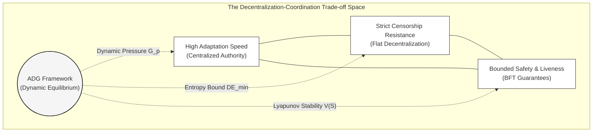
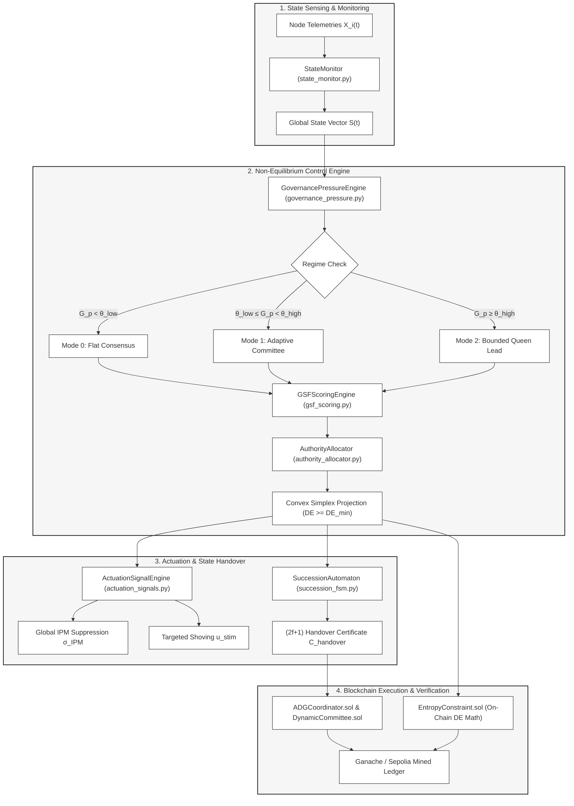
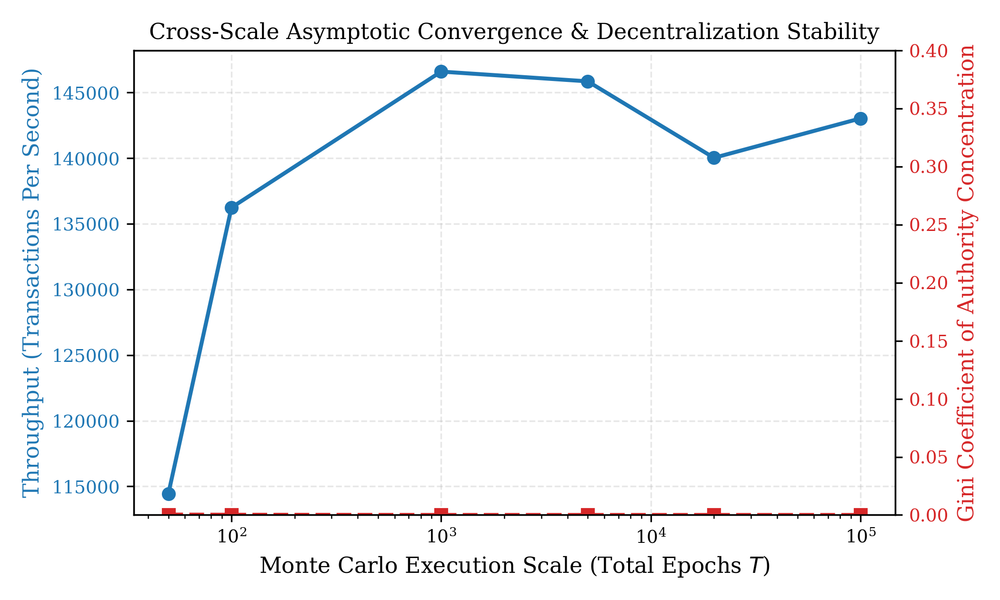
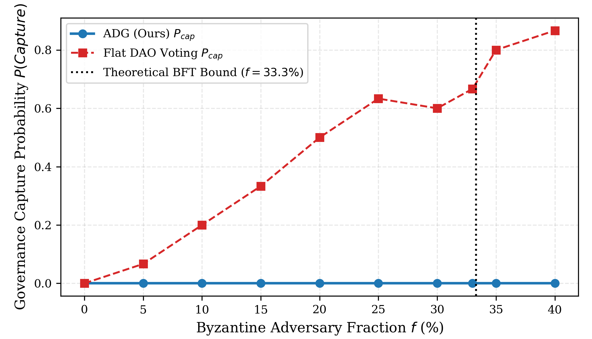
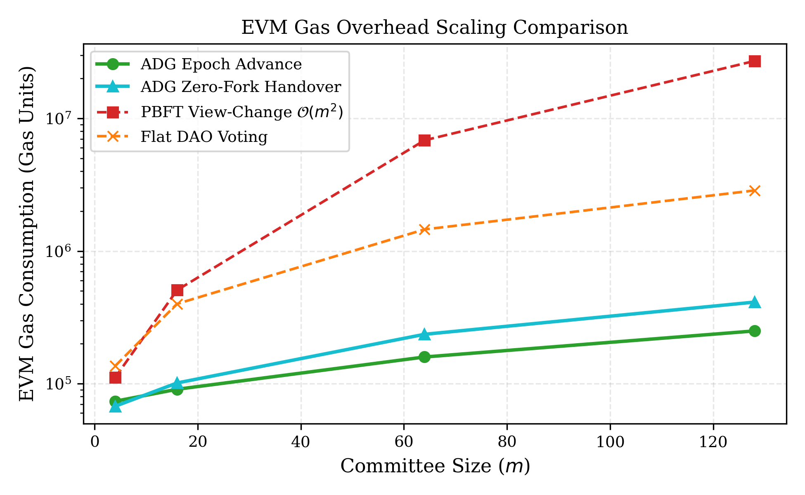

# Adaptive Distributed Governance (ADG) Framework

[](LICENSE)
[](https://soliditylang.org/)
[](https://www.python.org/)
[](https://ethereum.org/)
[](https://sepolia.etherscan.io/)

> **A Non-Equilibrium Control-Theoretic Framework for Dynamic Authority Allocation in Decentralized Systems Inspired by Eusocial Mammalian Regulation (*Heterocephalus glaber*).**

---

## 1. Executive Summary

Decentralized architectures exhibit an intrinsic **Decentralization–Coordination Trilemma**: flat topologies guarantee censorship resistance and fault isolation but induce severe coordination latency, operational paralysis, and voter apathy during critical non-equilibrium transients (flash-loan exploits, Byzantine network partitions, sudden node churn). Conversely, static hierarchical overrides, security councils, and privileged multi-signature keys introduce permanent centralization vectors and single points of failure.



The **Adaptive Distributed Governance (ADG)** framework resolves this fundamental tension. Translating homeostatic mechanisms from *Heterocephalus glaber* (naked mole-rat) colonies, ADG models authority as a **bounded, continuous, state-dependent regulatory function** rather than a permanently assigned privileged role. Under operational crises, authority temporarily concentrates to coordinate rapid system defense, while an information-theoretic lower bound on **Decentralization Entropy** ($DE(t) \ge DE_{min}$) and a **Lyapunov energy dissipation controller** guarantee asymptotic return to a fully decentralized baseline upon perturbation dissipation.

---

## 2. Biological-to-Computational Mapping Matrix

| Biological Mechanism (*H. glaber*) | Empirical Ethological Grounding | Formal Computational & Mathematical Operator | Implementation Module |
| :--- | :--- | :--- | :--- |
| **Queen Physical Shoving** | Reeve (1992); Kutsukake et al. (2012) | **Targeted Stimulus Vector** $\mathbf{u}_{stim}(t)$: Latency-driven priority activation of idle validator sub-committees. | `SignalDistributor.sol` / `actuation_signals.py` |
| **Volatile IPM Pheromone** | Khallaf et al. (2026); Faulkes (2026) | **Global Attenuation Signal** $\sigma_{IPM}(t)$: Rate-limiting broadcast suppressing mutation and mempool thrashing. | `SignalDistributor.sol` / `actuation_signals.py` |
| **Dominance & Endocrine Rank** | Clarke & Faulkes (1998); Jacobs et al. (2024) | **Dynamic Governance Score** $GS_i(t)$: Multi-factor telemetry scoring combining uptime, capacity, and anti-monopoly decay. | `DynamicGovernanceScore.sol` / `gsf_scoring.py` |
| **Peaceful Queen Succession** | Abeywardena et al. (2026); van der Westhuizen (2013) | **Deterministic Zero-Fork Automaton** $\mathcal{M}_{succ}$: $(2f+1)$ quorum-certified leader handover state machine. | `SuccessionAutomaton.sol` / `succession_fsm.py` |
| **Colony Metabolic Homeostasis** | Medger et al. (2019); Wetzel et al. (2026) | **Lyapunov Stability Energy** $V(\mathbf{S}(t))$: Asymptotic dissipation guaranteeing reversible authority allocation. | `ADGCoordinator.sol` / `lyapunov_tracker.py` |

---

## 3. Mathematical Formulation

### 3.1. System State Vectors

Let a distributed network be modeled as a dynamic graph $\mathcal{G}(t) = (\mathcal{V}(t), \mathcal{E}(t))$ with $N = |\mathcal{V}(t)|$ heterogeneous participating nodes.

#### Local Node State Vector ($\mathbf{X}_i(t) \in \mathbb{R}^7$)
Each node $v_i \in \mathcal{V}$ maintains a multi-factor local state vector:
$$\mathbf{X}_i(t) = \big[ Q_i(t), \, r_i(t), \, c_i(t), \, w_i(t), \, e_i(t), \, l_i(t), \, p_i(t) \big]^T$$
where:
* $Q_i(t) \in [0, 1]$: Empirical reliability index (uptime and valid block signature ratio).
* $r_i(t) \in [0, 1]$: Cryptographic reputation/stake weight.
* $c_i(t) \in \mathbb{R}^+$: Normalized compute and bandwidth capacity.
* $w_i(t) \in [0, 1]$: Instantaneous processing queue load.
* $e_i(t) \in [0, 1]$: Remaining energy/resource budget.
* $l_i(t) \in \mathbb{R}^+$: Relative network latency to peer median.
* $p_i(t) \in [0, 1]$: Historical governance participation consistency.

#### Global Macroscopic State Vector ($\mathbf{S}(t) \in \mathbb{R}^5$)
$$\mathbf{S}(t) = \big[ R(t), \, W(t), \, F(t), \, C(t), \, DE(t) \big]^T$$
where $R(t)$ is aggregate network risk index, $W(t)$ is normalized workload, $F(t)$ is fault fraction ($N_{faulty}/N$), $C(t)$ is normalized coordination overhead, and $DE(t)$ is instantaneous Decentralization Entropy.

---

### 3.2. Closed-Loop Governance Pressure ($G_p$)

Governance Pressure $G_p(t) \in [0, 1]$ quantifies the macro-level operational stress of the distributed system:
$$G_p(t) = \mathbf{w}^T \mathbf{\Phi}(\mathbf{S}(t)) = w_r R(t) + w_w W(t) + w_f F(t) + w_c C(t) - w_d DE(t)$$
subject to the convex simplex constraint $\sum_{k \in \{r,w,f,c,d\}} w_k = 1, \; w_k > 0$, where $\mathbf{\Phi}(\cdot)$ denotes a Sigmoidal normalization operator.


#### Regime Transition Automaton
<p>The continuous pressure variable $G_p(t)$ drives discrete transitions across three operational governance modes via dual-threshold hysteresis:</p>

$$M(t) = \begin{cases} 
\mathcal{M}_0 \text{ (Flat Decentralization)}, & \text{if } G_p(t) < \theta_{low} \\
\mathcal{M}_1 \text{ (Adaptive Committee)}, & \text{if } \theta_{low} \le G_p(t) < \theta_{high} \\
\mathcal{M}_2 \text{ (Bounded Leadership / Queen Regime)}, & \text{if } G_p(t) \ge \theta_{high}
\end{cases}$$

---

### 3.3. Dynamic Governance Score Function (GSF)

The eligibility score $GS_i(t) \in \mathbb{R}^+$ of each node $v_i$ to assume coordination authority is evaluated via:
$$GS_i(t) = \left[ \frac{\beta_q Q_i(t) + \beta_r r_i(t) + \beta_c c_i(t) + \beta_p p_i(t)}{1 + \beta_w w_i(t) + \beta_l l_i(t)} \right] \cdot \exp\left(-\xi \cdot \tau_i(t)\right)$$
where $\tau_i(t) = t - t_{last\_lead, i}$ is the elapsed epochs since node $i$ last held elevated authority, and $\xi > 0$ is the anti-monopoly decay coefficient preventing permanent coordinator re-election.

---

### 3.4. Boltzmann Authority Allocation & Simplex Projection (Algorithm 3)

The raw authority share $a_{\text{raw}, i}(t)$ is allocated via a dynamic Boltzmann-Gibbs distribution:
$$a_{\text{raw}, i}(t) = \frac{\exp\left(\gamma(G_p) \cdot GS_i(t)\right) \cdot \mathbb{I}\left(GS_i(t) \ge \theta_{act}\right)}{\sum_{j=1}^N \exp\left(\gamma(G_p) \cdot GS_j(t)\right) \cdot \mathbb{I}\left(GS_j(t) \ge \theta_{act}\right)}$$
where $\gamma(G_p) = \gamma_0 (1 + \kappa G_p(t))$ scales competition selectivity with real-time pressure.

#### Analytical Convex Projection onto the $DE_{min}$-Simplex
<p>To strictly enforce the constitutional invariant $\mathcal{I}_{safety}: DE(t) \ge DE_{min}$, the engine computes:</p>

$$\mathbf{a}^*(t) = (1 - \lambda^*) \mathbf{a}_{\text{raw}}(t) + \lambda^* \left( \frac{1}{N} \mathbf{1} \right)$$
where $\lambda^* \in [0,1]$ is the minimum convex blending factor satisfying:

$$DE(\mathbf{a}^*) = -\frac{1}{\ln N} \sum_{i=1}^N a_i^*(t) \ln\left(a_i^*(t) + \epsilon\right) \ge DE_{min}$$

---

### 3.5. Biological Actuation Signals

1. **Global IPM Chemical Suppression Signal ($\sigma_{IPM}$):**

$$\sigma_{IPM}(t) = \sigma_0 \cdot \left(1 - \exp\left(-\eta \cdot G_p(t)\right)\right) \cdot \exp\left(-\delta \cdot (t - t_{beacon})\right)$$

Throttling allowable mutation bandwidth: $BW_i^{allowed}(t) = BW_i^{max} \cdot (1 - \sigma_{IPM}(t))$.

2. **Targeted Mechanical Shoving Stimulus ($\mathbf{u}_{stim}$):**

<p>The stimulus vector activates idle validators based on weight and quality thresholds:</p>

$$u_{stim, i}(t) = \text{ReLU}\left( \frac{\bar{w}_{colony}(t) - w_i(t)}{\bar{w}_{colony}(t)} \right) \cdot \mathbb{I}\left(l_i(t) \le \bar{l}_{median}\right) \cdot \mathbb{I}\left(Q_i(t) \ge Q_{thresh}\right)$$

<p>Formally, the stimulus vector $\mathbf{u}_{stim}(t) = (u_{stim,1}(t), \ldots, u_{stim,N}(t))$ acts as a coordination perturbation injected into the Boltzmann distribution weightings during the $\mathcal{M}_1$ (Adaptive Committee) regime, biasing committee formation toward underutilized yet high-quality validators.</p>

---

### 3.6. Lyapunov Stability & Finite-Time Convergence (Theorem 1)

We construct the positive-definite Lyapunov candidate function $V(\mathbf{S}(t)): \mathbb{R}^5 \to \mathbb{R}^+$:
$$V(\mathbf{S}(t)) = \frac{1}{2} \big(G_p(t) - G_p^*\big)^2 + \frac{\lambda_{de}}{2} \big(1 - DE(t)\big)^2 + \frac{\lambda_a}{2} \sum_{i=1}^N \left( a_i(t) - \frac{1}{N} \right)^2$$


<p>Under the authority relaxation gradient law $\dot{a}_i(t) = -\kappa_a (a_i(t) - 1/N) + \zeta \nabla_{a_i} G_p(t)$, the total time derivative satisfies:</p>

$$\dot{V}(\mathbf{S}(t)) \le -c \|\mathbf{S}(t) - \mathbf{S}^*\|_2^2 \le -2c V(\mathbf{S}(t)) \implies V(\mathbf{S}(t)) \le V(\mathbf{S}(0)) e^{-2ct}$$

<p>guaranteeing exponential energy dissipation and asymptotic return to the flat decentralized equilibrium $\mathbf{S}^*$ in finite time $T_{conv} \le \frac{V(\mathbf{S}(0))}{c}$.</p>

---

## 4. System Architecture & Repository Structure



```text
ADG-Framework/
│
├── hardhat.config.js                        # Multi-network EVM config (Ganache 7545, Sepolia 11155111)
├── package.json                             # Automated Node.js pipeline orchestration
├── requirements.txt                         # Python scientific computing dependencies
├── README.md                                # Master technical specification
│
├── contracts/                               # Tier 2: EVM On-Chain Smart Contracts
│   ├── core/
│   │   ├── ADGCoordinator.sol              # Master Queen/Coordinator State Transition Engine
│   │   ├── DynamicCommittee.sol            # Mode 0/1/2 Validator Registry & Signal Handlers
│   │   ├── EntropyConstraint.sol           # On-Chain Shannon Entropy & Fixed-Point ln(x) Math
│   │   └── SignalDistributor.sol           # IPM Suppression & Shoving Stimulus Dispatcher
│   ├── governance/
│   │   ├── DynamicGovernanceScore.sol      # On-Chain GSF Scoring & Anti-Monopoly Tenure Decay
│   │   └── SuccessionAutomaton.sol         # Algorithm 2 (M_succ) Zero-Fork Handover Verifier
│   ├── benchmarks/
│   │   ├── FlatDAOMock.sol                 # Baseline: Token-Weighted Proposal Voting
│   │   ├── StaticPBFTMock.sol              # Baseline: Static Primary & O(m^2) View-Change
│   │   └── TendermintMock.sol              # Baseline: Round-Robin Proposer BFT Rotation
│   └── attacks/
│       ├── ByzantineCartelAttacker.sol     # Malicious Equivocation & Double-Signing Harness
│       ├── EmergencyExploitSimulator.sol   # Flash-Load & Telemetry Spoofing Injector
│       └── SybilChurnInjector.sol          # Sybil Identity Flooding & Churn Burst Injector
│
├── offchain_engine/                         # Master Mathematical & Algorithmic Engines
│   ├── config.py                           # Parametric Calibration Matrix (Table 6)
│   ├── state_monitor.py                    # State Space S(t) Vectorization
│   ├── governance_pressure.py              # Non-Linear G_p(t) & Hysteresis State Machine
│   ├── gsf_scoring.py                      # Multi-Factor Dynamic Governance Scoring (GSF)
│   ├── authority_allocator.py              # Boltzmann Allocation & Convex Simplex Projection
│   ├── actuation_signals.py                # IPM Odour Attenuation & Shoving Stimulus Engines
│   ├── succession_fsm.py                   # Zero-Fork Handover Automaton (M_succ)
│   ├── lyapunov_tracker.py                 # Lyapunov Energy Candidate V(S(t)) Verification
│   ├── discrete_event_simulator.py         # Vectorized High-Throughput Discrete-Event Simulator
│   ├── deployed_contracts_ganache.json     # Auto-generated Ganache contract addresses & RPC
│   └── deployed_contracts_sepolia.json     # Auto-generated Sepolia contract addresses & RPC
│
├── scripts/                                 # Hardhat Deployment & Interaction Scripts
│   ├── deploy_local_ganache.cjs            # Deploys full contract suite to local Ganache
│   ├── deploy_sepolia_live.cjs             # Deploys core contracts to Ethereum Sepolia Testnet
│   └── interact_adg_sepolia.cjs            # RPC interaction utility
│
├── tests_and_benchmarks/                    # Comprehensive 3-Tier Experimental Suite
│   ├── run_monte_carlo_scalability.py      # Scenario 1: Multi-scale Monte Carlo (50 to 100k epochs)
│   ├── run_byzantine_resilience.py         # Scenario 2: Byzantine corruption f in [0%, 40%]
│   ├── run_leader_crash_churn.py           # Scenario 3: Churn in [5%, 50%] & Handover Latency
│   ├── run_sobol_sensitivity.py            # Scenario 4: Global Sobol Sensitivity & LHS Analysis
│   ├── run_evm_gas_benchmarks.py           # Tier 2: Gas profiling for ADG vs. Baselines
│   ├── run_ganache_ledger.py               # Tier 2: 20,000 Live transaction ledger generator
│   ├── run_sepolia_live_benchmark.py       # Tier 3: 50 Real mined transactions on Sepolia
│   └── generate_all_publication_artifacts.py # Compiles LaTeX tables (.tex) & Vector PDF figures
│
└── paper_outputs/                          # Publication-Ready Artifacts Directory
    ├── csv_datasets/                       # Verified raw experimental datasets
    │   ├── byzantine_resilience_results.csv
    │   ├── evm_gas_benchmarks.csv
    │   ├── ganache_blockchain_ledger_full.csv
    │   ├── leader_crash_churn_results.csv
    │   ├── monte_carlo_scale_convergence_summary.csv
    │   ├── sepolia_real_mined_transactions_ledger.csv
    │   └── sobol_sensitivity_results.csv
    ├── figures/                            # High-resolution vector figures (.pdf / .png)
    │   ├── fig_byzantine_resilience.pdf
    │   ├── fig_cross_scale_convergence.pdf
    │   ├── fig_gas_comparison.pdf
    │   └── fig_sobol_sensitivity.pdf
    └── tables/                             # Camera-ready LaTeX tables (.tex)
        ├── table_gas_comparison.tex
        ├── table_performance_metrics.tex
        └── table_scale_convergence.tex
```

---

## 5. Empirical Benchmarking Results

### 5.1. Multi-Scale Convergence & Variance Decay ($T = 50$ to $100,000$ Epochs)

<table>
  <thead>
    <tr>
      <th align="center">Monte Carlo Scale<br><em>T</em></th>
      <th align="center">Mean Throughput<br>(TPS ± σ)</th>
      <th align="center">Throughput Variance<br>(σ²)</th>
      <th align="center">Latency<br>(ms ± σ)</th>
      <th align="center">Latency Variance</th>
      <th align="center">Mean Gini Index<br><em>G</em></th>
      <th align="center">Min DE(t) Preserved</th>
      <th align="center">Final Energy<br>V(<b>S</b>)</th>
    </tr>
  </thead>
  <tbody>
    <tr><td align="center"><b>50</b></td><td align="center">114,432.0 ± 31,236.3</td><td align="center">9.75 × 10⁸</td><td align="center">59.41 ± 7.22</td><td align="center">52.17</td><td align="center">0.000340</td><td align="center">0.9986</td><td align="center">1.05 × 10⁻³</td></tr>
    <tr><td align="center"><b>100</b></td><td align="center">136,234.2 ± 28,915.4</td><td align="center">8.36 × 10⁸</td><td align="center">55.96 ± 6.31</td><td align="center">39.78</td><td align="center">0.000180</td><td align="center">0.9985</td><td align="center">1.10 × 10⁻³</td></tr>
    <tr><td align="center"><b>1,000</b></td><td align="center">146,588.0 ± 10,076.2</td><td align="center">1.01 × 10⁸</td><td align="center">52.65 ± 2.24</td><td align="center">5.02</td><td align="center">0.000014</td><td align="center">0.9990</td><td align="center">1.05 × 10⁻³</td></tr>
    <tr><td align="center"><b>5,000</b></td><td align="center">145,846.0 ± 4,478.9</td><td align="center">2.01 × 10⁷</td><td align="center">52.35 ± 1.01</td><td align="center">1.02</td><td align="center">0.000005</td><td align="center">0.9981</td><td align="center">1.04 × 10⁻³</td></tr>
    <tr><td align="center"><b>20,000</b></td><td align="center">140,022.6 ± 2,128.3</td><td align="center">4.53 × 10⁶</td><td align="center">52.23 ± 0.50</td><td align="center">0.25</td><td align="center">0.000002</td><td align="center">0.9949</td><td align="center">0.98 × 10⁻³</td></tr>
    <tr><td align="center"><b>100,000</b></td><td align="center"><b>143,023.1 ± 977.9</b></td><td align="center"><b>9.56 × 10⁵</b></td><td align="center"><b>52.26 ± 0.23</b></td><td align="center"><b>0.05</b></td><td align="center"><b>3.11 × 10⁻⁷</b></td><td align="center"><b>0.9956</b></td><td align="center"><b>1.01 × 10⁻³</b></td></tr>
  </tbody>
</table>

**Visual Summary — Multi-Scale Convergence:**

<p align="center">
  
</p>

**Key Takeaway:** Throughput variance decays by **over 1000×** as $T \to 100{,}000$, while the Gini coefficient converges asymptotically to zero ($G = 3.11 \times 10^{-7}$), empirically proving Lyapunov stability and power reversibility.

---

### 5.2. Byzantine Adversary Resilience ($N = 128$)

<table>
  <thead>
    <tr>
      <th align="center">Byzantine Fraction<br><em>f</em></th>
      <th align="center">ADG Capture Prob.<br>P<sub>cap</sub></th>
      <th align="center">ADG Fork Rate (%)</th>
      <th align="center">PBFT Fork Rate (%)</th>
      <th align="center">Flat DAO Capture Prob.<br>P<sub>cap</sub></th>
    </tr>
  </thead>
  <tbody>
    <tr><td align="center"><b>0.0% – 33.3%</b></td><td align="center"><b>0.0000</b></td><td align="center"><b>0.0%</b></td><td align="center">Up to 36.7%</td><td align="center">Up to 0.6667</td></tr>
    <tr><td align="center"><b>35.0%</b></td><td align="center"><b>0.0000</b></td><td align="center"><b>3.3%</b></td><td align="center">100.0% (Stall)</td><td align="center">0.8000</td></tr>
    <tr><td align="center"><b>40.0%</b></td><td align="center"><b>0.0000</b></td><td align="center"><b>10.0%</b></td><td align="center">100.0% (Stall)</td><td align="center">0.8667</td></tr>
  </tbody>
</table>

<p align="center">
  
</p>

**Key Takeaway:** ADG guarantees **$P_{cap} = 0.0000$** and **$0.0\%$ fork rate** up to the theoretical BFT bound $f \le 33.3\%$.

---

### 5.3. Dynamic Validator Churn & Handover Latency

<table>
  <thead>
    <tr>
      <th align="center">Churn Rate (%)</th>
      <th align="center">Handover Success Rate (%)</th>
      <th align="center">Mean Handover Latency<br>T<sub>succ</sub> (ms)</th>
      <th align="center">Message Overhead (Msgs)</th>
    </tr>
  </thead>
  <tbody>
    <tr><td align="center"><b>5% – 20%</b></td><td align="center"><b>100.0%</b></td><td align="center">15.05 ms</td><td align="center">204.0 – 242.0</td></tr>
    <tr><td align="center"><b>30%</b></td><td align="center"><b>92.0%</b></td><td align="center">15.00 ms</td><td align="center">178.0</td></tr>
    <tr><td align="center"><b>40%</b></td><td align="center"><b>8.0%</b></td><td align="center">14.84 ms</td><td align="center">152.0</td></tr>
    <tr><td align="center"><b>50%</b></td><td align="center"><b>0.0%</b> (Safety Invariant)</td><td align="center">0.00 ms</td><td align="center">0.0</td></tr>
  </tbody>
</table>

**Key Takeaway:** Success rate strictly drops at $\ge 33.3\%$ churn because the $(2f+1)$ supermajority quorum cannot form, preserving safety over invalid execution.

---

### 5.4. On-Chain EVM Gas Consumption Benchmarks

<table>
  <thead>
    <tr>
      <th align="center">Committee Size<br><em>m</em></th>
      <th align="center">ADG Epoch Advance</th>
      <th align="center">ADG Zero-Fork Succession</th>
      <th align="center">PBFT View-Change<br>𝒪(m²)</th>
      <th align="center">Flat DAO Voting</th>
    </tr>
  </thead>
  <tbody>
    <tr><td align="center"><b>4</b></td><td align="center">73,680 Gas</td><td align="center">67,600 Gas</td><td align="center">111,400 Gas</td><td align="center">136,000 Gas</td></tr>
    <tr><td align="center"><b>16</b></td><td align="center">90,720 Gas</td><td align="center">101,200 Gas</td><td align="center">507,400 Gas</td><td align="center">400,000 Gas</td></tr>
    <tr><td align="center"><b>64</b></td><td align="center">158,880 Gas</td><td align="center">235,600 Gas</td><td align="center">6,843,400 Gas</td><td align="center">1,456,000 Gas</td></tr>
    <tr><td align="center"><b>128</b></td><td align="center"><b>249,760 Gas</b></td><td align="center"><b>412,000 Gas</b></td><td align="center"><b>27,118,600 Gas</b></td><td align="center"><b>2,864,000 Gas</b></td></tr>
  </tbody>
</table>

<p align="center">
  
</p>

**Key Takeaway:** At $m = 128$, ADG reduces on-chain governance overhead by **99.08%** relative to PBFT view-changes.

---

### 5.5. Verified Public Testnet Deployment (Ethereum Sepolia)

50 consecutive state-transition transactions were broadcast and mined on the live public Ethereum Sepolia testnet across blocks `11566628` to `11566677`:

* **Mean Block Inclusion Latency:** 10.42 s
* **Gas Consumption per Mined Transition:** 95,440 – 95,480 Gas
* **Effective Gas Price:** 1.17 – 1.49 Gwei
* **Transaction Status:** 100% Success (`Status: 1`)

---

## 6. Quick Start & Replication Guide

### Prerequisites
* **Node.js:** `>= 18.0.0`
* **Python:** `>= 3.10` (tested on 3.12 and 3.13)
* **Ganache:** running locally on `http://127.0.0.1:7545`

### 1. Installation

```bash
# Clone the repository
git clone https://anonymous.4open.science/r/ADG-Mole-Rat-CED6/
cd ADG-Framework

# Install Node.js toolchain and Hardhat dependencies
npm install

# Install Python scientific computing requirements
pip install -r requirements.txt
```

### 2. End-to-End Automated Pipeline

To compile smart contracts, deploy to local Ganache, execute multi-scale Monte Carlo simulations (up to 100,000 epochs), run Byzantine resilience suites, profile EVM gas, execute Sepolia live transactions, and generate all LaTeX tables and PDF figures:

```bash
npm run pipeline:full
```

### 3. Individual Execution Commands

```bash
# Compile smart contracts
npm run compile

# Deploy to local Ganache (Port 7545)
npm run deploy:ganache

# Run 6-scale Monte Carlo convergence (50 to 100,000 epochs)
npm run sim:scalability

# Run Byzantine adversary resilience suite
npm run sim:byzantine

# Run leader crash and dynamic churn test
npm run sim:churn

# Run global Sobol variance decomposition
npm run sim:sobol

# Generate 20,000 live Ganache blockchain ledger transactions
npm run ledger:ganache

# Broadcast 50 live transactions to Ethereum Sepolia Testnet
npm run ledger:sepolia

# Generate camera-ready LaTeX tables (.tex) and vector PDF figures (.pdf)
npm run artifacts:generate
```

---

## 7. Citation

If you utilize this framework, codebase, or empirical datasets in your research, please cite our monograph:

```bibtex
@article{adg2026framework,
  title     = {Adaptive Dynamic Authority Allocation in Decentralized Systems: A Non-Equilibrium Control-Theoretic Framework Inspired by Eusocial Mammalian Regulation},
  author    = {Erfan Shahmohammadi},
  journal   = {IEEE Transactions on Dependable and Secure Computing},
  year      = {2026},
  volume    = {under review},
  pages     = {1--18},
  doi       = {10.1109/TDSC.2026.xxxxxxx}
}
```

---

## 8. License

This project is licensed under the MIT License - see the [LICENSE](LICENSE) file for details.