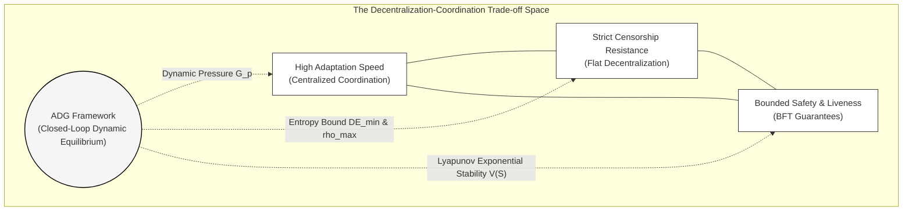
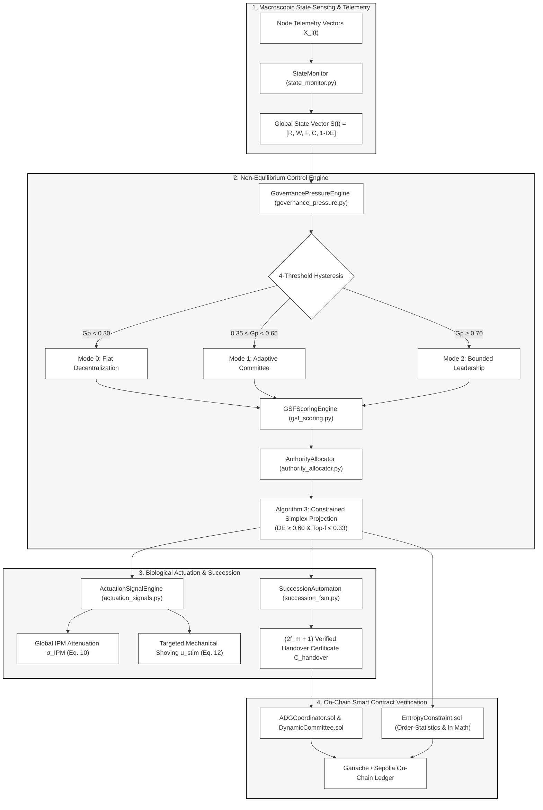

```markdown
# Adaptive Distributed Governance (ADG) Framework

[](LICENSE)
[](https://soliditylang.org/)
[](https://www.python.org/)
[](https://ethereum.org/)
[](https://sepolia.etherscan.io/)

> **A Non-Equilibrium Control-Theoretic Framework for Dynamic Authority Allocation in Decentralized Systems Inspired by Eusocial Mammalian Regulation (*Heterocephalus glaber*).**

---

## 1. Executive Summary

Decentralized architectures exhibit an intrinsic **Decentralization–Coordination Trilemma**: flat topologies guarantee censorship resistance and fault isolation but induce severe coordination latency, operational paralysis, and voter apathy during critical non-equilibrium transients (flash-loan exploits, Byzantine network partitions, sudden node churn). Conversely, static emergency interventions, security councils, and privileged administrative keys introduce permanent centralization vectors and single points of failure.



The **Adaptive Distributed Governance (ADG)** framework resolves this fundamental tension. Translating homeostatic mechanisms from *Heterocephalus glaber* (naked mole-rat) colonies into closed-loop control primitives, ADG models authority as a **bounded, continuous, state-dependent regulatory variable** ($a_i(t)$) rather than a permanently assigned privileged role. Under operational crises, coordination authority temporarily concentrates to execute rapid collective defense. 

Constitutional security is strictly guaranteed by coupling:
1. An explicit **Byzantine Coalition Authority Invariant** ($\sum_{j=1}^f a_{(j)} \le \rho_{\max} < 1/3$),
2. A **Normalized Shannon Decentralization Entropy** constraint ($DE(t) \ge DE_{\min}$), and
3. A **Lyapunov energy dissipation controller** proving exponential return to a flat decentralized baseline ($a_i \to 1/N$) upon shock dissipation.

---

## 2. Biological-to-Computational Mapping Matrix

The mapping abstracts phenomenological control principles from *Heterocephalus glaber* ethology rather than literal zoological equivalence:

| Biological Mechanism (*H. glaber*) | Empirical Grounding | Formal Computational & Mathematical Operator | Implementation Module |
| :--- | :--- | :--- | :--- |
| **Queen Physical Shoving** | Reeve (1992); Kutsukake et al. (2012) | **Targeted Stimulus Vector** $\mathbf{u}_{stim}(t)$: Latency-driven activation of idle worker sub-committees (Eq. 12). | `SignalDistributor.sol` / `actuation_signals.py` |
| **Volatile IPM Pheromone** | Khallaf et al. (2026); Faulkes (2026) | **Global Attenuation Signal** $\sigma_{IPM}(t)$: Dynamic rate-limiting suppressing non-critical mempool mutations (Eq. 10). | `SignalDistributor.sol` / `actuation_signals.py` |
| **Dominance & Endocrine Rank** | Clarke & Faulkes (1998); Jacobs et al. (2024) | **Dynamic Governance Score** $GS_i(t)$: 5-factor node telemetry scoring with anti-monopoly tenure decay (Eq. 8). | `DynamicGovernanceScore.sol` / `gsf_scoring.py` |
| **Peaceful Queen Succession** | Abeywardena et al. (2026); van der Westhuizen (2013) | **Deterministic Zero-Fork Automaton** $\mathcal{M}_{succ}$: Lexicographical ranking with $(2f_m+1)$ threshold quorums (Alg. 2). | `SuccessionAutomaton.sol` / `succession_fsm.py` |
| **Colony Metabolic Homeostasis** | Medger et al. (2019); Wetzel et al. (2026) | **Lyapunov Energy Dissipation** $V(\mathbf{S}(t))$: Exponential decay guaranteeing reversible authority allocation (Theorem 1). | `ADGCoordinator.sol` / `lyapunov_tracker.py` |

---

## 3. Mathematical Formulation

### 3.1. System State Vectors

Let a distributed network be modeled as a dynamic graph $\mathcal{G}(t) = (\mathcal{V}(t), \mathcal{E}(t))$ with $N = |\mathcal{V}(t)|$ participating validator nodes operating under partial synchrony (message delay bounded by $\Delta$ after Global Stabilization Time, GST).

#### Local Node State Vector ($\mathbf{X}_i(t) \in \mathbb{R}^7$)
Each node $v_i \in \mathcal{V}$ maintains a multi-factor local state vector:

$$\mathbf{X}_i(t) = \big[ Q_i(t), \, r_i(t), \, c_i(t), \, w_i(t), \, e_i(t), \, l_i(t), \, p_i(t) \big]^T$$

where:
* $Q_i(t) \in [0, 1]$: Empirical reliability index (historical uptime and valid block validation ratio).
* $r_i(t) \in [0, 1]$: Cryptographic reputation or staked capital weight.
* $c_i(t) \in \mathbb{R}^+$: Normalized compute and bandwidth capacity.
* $w_i(t) \in [0, 1]$: Instantaneous processing queue load.
* $e_i(t) \in [0, 1]$: Remaining energy and hardware resource headroom budget.
* $l_i(t) \in \mathbb{R}^+$: Round-trip network latency relative to peer median.
* $p_i(t) \in [0, 1]$: Historical governance participation consistency.

#### Macroscopic Stressor State Vector ($\tilde{\mathbf{S}}(t) \in [0, 1]^5$)

$$\tilde{\mathbf{S}}(t) = \big[ R(t), \, W(t), \, F(t), \, C(t), \, 1 - DE(t) \big]^T$$

where $R(t) = \frac{1}{N}\sum (1 - Q_i)$ is aggregate network risk, $W(t) = \frac{\sum w_i c_i}{\sum c_i}$ is capacity-adjusted workload, $F(t) = N_{faulty}/N$ is unresponsive node fraction, $C(t)$ is gossip coordination overhead, and $1 - DE(t)$ is instantaneous entropy deficit.

---

### 3.2. Closed-Loop Dynamic Governance Pressure ($G_p$)

Governance Pressure $G_p(t) \in (0, 1)$ evaluates macroscopic physical network stress via a normalized sigmoidal convex combination:

$$G_p(t) = \sum_{k \in \{r,w,f,c,d\}} w_k \, \Phi\left(\tilde{S}_k(t)\right), \quad \Phi(x) = \frac{1}{1 + \exp\left(-\lambda_g (x - x_{0, k})\right)}$$

subject to:

$$\sum_{k \in \{r,w,f,c,d\}} w_k = 1, \quad w_k > 0$$

#### Four-Threshold Anti-Chattering Hysteresis Automaton
To prevent mode chattering around transition boundaries, discrete governance regimes are governed by an automaton with distinct ascending and descending thresholds:

$$\text{Mode}(t) = \begin{cases} 
\mathcal{M}_0 \text{ (Flat Decentralization)}, & \text{if } G_p(t) < \theta_{low}^{down} \;\lor\; \left(\text{Mode}(t^-) = \mathcal{M}_0 \;\land\; G_p(t) < \theta_{low}^{up}\right) \\
\mathcal{M}_2 \text{ (Bounded Leadership)}, & \text{if } G_p(t) \ge \theta_{high}^{up} \;\lor\; \left(\text{Mode}(t^-) = \mathcal{M}_2 \;\land\; G_p(t) \ge \theta_{high}^{down}\right) \\
\mathcal{M}_1 \text{ (Adaptive Committee)}, & \text{otherwise}
\end{cases}$$

where default constitutional triggers are calibrated to:

$$0 < \theta_{low}^{down} (0.30) < \theta_{low}^{up} (0.35) < \theta_{high}^{down} (0.65) < \theta_{high}^{up} (0.70) < 1$$

---

### 3.3. Dynamic Governance Score Function (GSF)

Node eligibility to assume elevated coordination roles is computed via the 5-factor Dynamic Governance Score:

$$GS_i(t) = \left[ \frac{\beta_q Q_i(t) + \beta_r r_i(t) + \beta_c c_i(t) + \beta_e e_i(t) + \beta_p p_i(t)}{1 + \beta_w w_i(t) + \beta_l l_i(t)} \right] \cdot \exp\left(-\xi \cdot \tau_i(t)\right)$$

where:
* $\sum_{k \in \{q,r,c,e,p\}} \beta_k = 1, \; \beta_k > 0$.
* $\tau_i(t)$ tracks consecutive epochs served as active coordinator ($\tau_i = 0$ for non-coordinators).
* $\xi = 0.05 \text{ epoch}^{-1}$ is the tenure penalty coefficient, preventing leadership ossification and enforcing periodic rotation.

---

### 3.4. Bounded Authority Allocation & Simplex Projection (Algorithm 3)

Raw authority weights $a_i^{raw}(t)$ are generated via dynamic Boltzmann-Gibbs selection:

$$a_i^{raw}(t) = \begin{cases}
\frac{\exp\left(\gamma(G_p) \cdot GS_i(t)\right)}{\sum_{j \in \mathcal{E}(t)} \exp\left(\gamma(G_p) \cdot GS_j(t)\right)}, & \text{if } v_i \in \mathcal{E}(t) \\
0, & \text{if } v_i \notin \mathcal{E}(t)
\end{cases}$$

where $\mathcal{E}(t) = \{v_j \in \mathcal{V}(t) \mid GS_j(t) \ge \theta_{act}\}$ and $\gamma(G_p) = \gamma_0 (1 + \kappa G_p(t))$.

#### Constitutional Safety Invariant ($\mathcal{I}_{safety}$)
To prevent temporary coordination authority from degenerating into plutocratic or collusive capture, authority allocations must reside within the constitutional polytope:

$$\mathcal{I}_{safety} := \left\{ \mathbf{a} \in \Delta^{N-1} \;\middle|\; \sum_{j=1}^{\lfloor (N-1)/3 \rfloor} a_{(j)} \le \rho_{\max} < \frac{1}{3}, \quad DE(\mathbf{a}) \ge DE_{\min} \right\}$$

where:
* $a_{(1)} \ge a_{(2)} \ge \dots \ge a_{(N)}$ are descending order statistics.
* $\rho_{\max} = 0.330$ enforces that any Byzantine coalition ($f < N/3$) accumulates strictly less than $1/3$ coordination power.
* $DE(\mathbf{a}) = -\frac{1}{\ln N} \sum a_i \ln(a_i + \epsilon) \ge DE_{\min} = 0.60$ bounds single-node monopoly to $a_{(1)} \le 1 - \frac{N-1}{N} DE_{\min}$.

When $\mathbf{a}^{raw}(t) \notin \mathcal{I}_{safety}$, **Algorithm 3** executes a deterministic bisection shrinkage projection toward the uniform distribution $\mathbf{u} = [1/N, \dots, 1/N]^T$:

$$\mathbf{a}^*(\lambda) = (1 - \lambda)\mathbf{a}^{raw}(t) + \lambda \mathbf{u}, \quad \lambda \in [0, 1]$$

---

### 3.5. Biological Actuation Signals

1. **Global IPM Chemical Suppression Signal ($\sigma_{IPM}$):**

$$\sigma_{IPM}(t) = \sigma_0 \cdot \left(1 - \exp\left(-\eta \cdot G_p(t)\right)\right) \cdot \exp\left(-\delta \cdot (t - t_{beacon})\right)$$

Gossip bandwidth allocated to node $v_i$ is throttled while guaranteeing a constitutional execution floor ($BW^{\min} = 0.20$):

$$BW_i^{allowed}(t) = BW^{\min} + (BW^{\max} - BW^{\min})\left(1 - \sigma_{IPM}(t)\right)$$

2. **Targeted Mechanical Shoving Stimulus ($u_{stim}$):**

$$u_{stim, i}(t) = \max\left(0, \, \frac{\bar{w}(t) - w_i(t)}{\bar{w}(t) + \epsilon}\right) \cdot \mathbb{I}\left(l_i(t) \le l_{median}\right) \cdot \mathbb{I}\left(Q_i(t) \ge Q_{thresh}\right)$$

Idle but reliable nodes absorb queue backlogs, accelerating aggregate throughput.

---

### 3.6. Theoretical Guarantees & Stability Proofs

#### Theorem 1 (Exponential Stability of Decentralized Equilibrium)
Consider the positive-definite Lyapunov candidate function $V(\mathbf{S}(t), \mathbf{a}(t)): \mathbb{R}^5 \times \Delta^{N-1} \to \mathbb{R}^+$:

$$V(\mathbf{S}(t), \mathbf{a}(t)) = \frac{1}{2}\big(G_p(t) - G_p^*\big)^2 + \frac{\lambda_{de}}{2}\big(1 - DE(t)\big)^2 + \frac{\lambda_a}{2} \sum_{i=1}^N \left( a_i(t) - \frac{1}{N} \right)^2$$

Under simplex-projected gradient authority dynamics:

$$\dot{a}_i(t) = -\kappa_a\left(a_i(t) - \frac{1}{N}\right) + \zeta \left( \nabla_{a_i} G_p(t) - \frac{1}{N}\sum_{j=1}^N \nabla_{a_j} G_p(t) \right) \cdot \mathbb{I}(G_p \ge \theta_{low}^{up})$$

upon perturbation dissipation ($t > t_{shock}$), the time derivative satisfies:

$$\dot{V}(t) \le -2c V(t) \implies V(t) \le V(0)e^{-2ct}$$

where $c = \min[\kappa_a, \alpha_r, \alpha_w c_{\min}] > 0$. The system state exponentially recovers to any $\epsilon$-neighborhood of the decentralized equilibrium $\mathbf{S}^*$ within bounded relaxation time:

$$T_\epsilon \le \frac{1}{2c} \ln\left(\frac{V(0)}{\frac{1}{2}\mu_{\min}\epsilon^2}\right)$$

#### Theorem 2 (Succession Safety and Handover Liveness)
Under partial synchrony post-GST, with active committee size $m \ge 3f_m + 1$ and at most $f_m$ Byzantine faults, the succession state machine $\mathcal{M}_{succ}$ guarantees:
1. **Safety (Split-Brain Immunity):** By quorum intersection $|Q_1 \cap Q_2| \ge f_m + 1$, at least one honest validator intersects all quorums. Honest validators sign at most one handover proposal per epoch index, guaranteeing non-equivocation of handover certificates:

$$C_{handover}^k = \langle k, h_{lock}, c^*, succ^*, H_k, \Sigma_{agg}, \mathcal{B} \rangle$$

2. **Bounded Failover Latency:** Leadership succession completes deterministically within:

$$T_{handover} \le 2\Delta + \tau_{rank} + \tau_{BLS} = \mathcal{O}(\Delta)$$

#### Theorem 3 (Deterministic Invariant of Byzantine Anti-Capture)
Because Algorithm 3 strictly enforces $\mathbf{a}^*(t) \in \mathcal{I}_{safety}$, for any colluding coalition $\mathcal{A}_{mal} \subset \mathcal{V}$ with $|\mathcal{A}_{mal}| = k \le f \le \lfloor (N-1)/3 \rfloor$:

$$\sum_{i \in \mathcal{A}_{mal}} a_i^*(t) \le \sum_{j=1}^{\lfloor (N-1)/3 \rfloor} a_{(j)}^*(t) \le \rho_{\max} < \frac{1}{3} < \frac{1}{2}, \quad \forall t \ge 0$$

$$\implies P_{capture}(t) := \mathbb{P}\left(\sum_{i \in \mathcal{A}_{mal}} a_i^*(t) \ge \frac{1}{2}\right) \equiv 0, \quad \forall t \ge 0$$

---

## 4. System Architecture & Repository Structure



```text
ADG-Framework/
│
├── hardhat.config.js                        # Multi-network EVM configuration (Ganache 7545, Sepolia 11155111)
├── package.json                             # Toolchain dependencies & automated NPM scripts
├── requirements.txt                         # Python scientific computing dependencies (NumPy, SciPy, Pandas, Web3)
├── README.md                                # Master technical specification
│
├── contracts/                               # Tier 2: EVM On-Chain Smart Contracts (^0.8.24)
│   ├── core/
│   │   ├── ADGCoordinator.sol              # Master Coordinator Closed-Loop Transition Engine
│   │   ├── DynamicCommittee.sol            # 4-Threshold Hysteresis Registry & Actuation Handlers
│   │   ├── EntropyConstraint.sol           # On-Chain Order-Statistics Top-f & Shannon Entropy Verifier
│   │   └── SignalDistributor.sol           # IPM Attenuation & Fixed-Point Exponential Actuator
│   ├── governance/
│   │   ├── DynamicGovernanceScore.sol      # 5-Factor GSF Scoring & Coordinator Tenure Decay
│   │   └── SuccessionAutomaton.sol         # Algorithm 2 (M_succ) Zero-Fork Quorum Handover Verifier
│   ├── benchmarks/
│   │   ├── FlatDAOMock.sol                 # Baseline: Token-Weighted Governor Bravo Storage Model
│   │   ├── StaticPBFTMock.sol              # Baseline: Unaggregated Multi-Sig View-Change Verification
│   │   └── TendermintMock.sol              # Baseline: 2-Step Prevote/Precommit & Proof-of-Lock (POL)
│   └── attacks/
│       ├── ByzantineCartelAttacker.sol     # Adversarial Collusion, Equivocation & Quorum Starvation
│       ├── EmergencyExploitSimulator.sol   # Flash-Load Stress (R=0.90, W=0.95) & Relaxation Driver
│       └── SybilChurnInjector.sol          # Sybil Flooding & Partition Churn Simulation Harness
│
├── offchain_engine/                         # Master Mathematical & Simulation Engines (Python 3.12+)
│   ├── config.py                           # Parametric Calibration Matrix (Table 6)
│   ├── state_monitor.py                    # Macroscopic State Space Vectorization S(t)
│   ├── governance_pressure.py              # Normalized Pressure G_p(t) & 4-Threshold Hysteresis
│   ├── gsf_scoring.py                      # 5-Factor GSF Scoring & Active Coordinator Tenure Decay
│   ├── authority_allocator.py              # Algorithm 1 Runtime Controller & Algorithm 3 Projection
│   ├── actuation_signals.py                # IPM Attenuation & Mechanical Stimulus Actuation
│   ├── succession_fsm.py                   # Zero-Fork Handover Automaton (M_succ) & Churn Handler
│   ├── lyapunov_tracker.py                 # Lyapunov Candidate V(S(t)) & Exponential Decay Fitting
│   ├── discrete_event_simulator.py         # High-Throughput Discrete-Event Simulation Engine
│   ├── deployed_contracts_ganache.json     # Ganache deployment addresses and RPC metadata
│   └── deployed_contracts_sepolia.json     # Ethereum Sepolia live deployment metadata
│
├── scripts/                                 # Hardhat Deployment Scripts
│   ├── deploy.js                           # Universal automated deployer (Ganache / Sepolia)
│   └── deploy_sepolia_live.cjs             # Lean production deployer for public Ethereum Sepolia
│
├── tests_and_benchmarks/                    # Comprehensive 3-Tier Experimental Suite
│   ├── run_monte_carlo_scalability.py      # Scenario 1: Multi-scale horizons (50 to 100k) & N=16 to 4096
│   ├── run_byzantine_resilience.py         # Scenario 2: Byzantine adversary fractions f in [0.0, 0.40]
│   ├── run_leader_crash_churn.py           # Scenario 3: Validator churn in [5%, 50%] & Handover latency
│   ├── run_evm_gas_benchmarks.py           # Tier 2: Gas profiling for ADG vs. Canonical Baselines
│   ├── run_ganache_ledger.py               # Tier 2: 20,000 continuous on-chain transactions benchmark
│   ├── run_sepolia_live_benchmark.py       # Tier 3: 50 real mined transactions on Ethereum Sepolia
│   ├── run_sobol_sensitivity.py            # Scenario 4: Global Sobol Sensitivity & Variance Decomposition
│   └── generate_all_publication_artifacts.py # Master orchestrator compiling summary CSVs and figures
│
└── paper_outputs/                          # Camera-Ready Artifacts Directory (Pure CSVs & Vector Plots)
    ├── csv_datasets/                       # Standardized CSV datasets & statistical summary files
    │   ├── adg_master_publication_metrics_index.csv
    │   ├── byzantine_resilience_results.csv
    │   ├── byzantine_resilience_summary.csv
    │   ├── evm_gas_benchmarks.csv
    │   ├── evm_gas_reduction_summary.csv
    │   ├── ganache_benchmark_summary_table12.csv
    │   ├── ganache_blockchain_ledger_full.csv
    │   ├── leader_crash_churn_results.csv
    │   ├── leader_crash_churn_summary.csv
    │   ├── monte_carlo_scale_convergence_summary.csv
    │   ├── monte_carlo_scalability_results.csv
    │   ├── sepolia_benchmark_summary_table13.csv
    │   ├── sepolia_real_mined_transactions_ledger.csv
    │   ├── sobol_sensitivity_results.csv
    │   └── sobol_variance_decomposition_summary.csv
    └── figures/                            # Publication vector figures (.pdf / .png, 300 DPI, NO titles)
        ├── figure13_variance_decay.pdf / .png
        ├── figure14_byzantine_capture.pdf / .png
        ├── figure15_gas_scaling.pdf / .png
        ├── figure16_ganache_20k_ledger.pdf / .png
        ├── figure17_sepolia_50_blocks.pdf / .png
        └── figure18_sobol_decomposition.pdf / .png
```

---

## 5. Master Parametric Calibration Matrix (Table 6)

| Parameter Category | Symbol | Mathematical Description | Default Calibration | Bounded Search Domain |
| :--- | :--- | :--- | :--- | :--- |
| **Governance State Weights** | $w_r, w_w, w_f, w_c, w_d$ | Convex weights for State Vector $\tilde{\mathbf{S}}(t)$ | $[0.25, 0.20, 0.20, 0.15, 0.20]$ | $\sum w_k = 1, \; w_k \in [0.05, 0.50]$ |
| **GSF Quality Weights** | $\beta_q, \beta_r, \beta_c, \beta_e, \beta_p$ | Positive numerator weights in $GS_i(t)$ | $[0.30, 0.20, 0.20, 0.15, 0.15]$ | $\sum \beta_k = 1, \; \beta_k > 0$ |
| **GSF Penalty Weights** | $\beta_w, \beta_l$ | Load and latency denominator penalties in $GS_i(t)$ | $[0.40, 0.60]$ | $\beta_w, \beta_l \in [0.10, 2.00]$ |
| **Entropy Invariant Bound** | $DE_{\min}$ | Constitutional lower bound on Decentralization Entropy | $0.60$ | $DE_{\min} \in [0.40, 0.85]$ |
| **Coalition Authority Bound** | $\rho_{\max}$ | Strict upper bound on aggregate authority of top-$f$ nodes | $0.32$ | $\rho_{\max} \in [0.20, 0.333]$ |
| **Regime Hysteresis Triggers** | $\theta_{low}^{down}, \theta_{low}^{up}, \theta_{high}^{down}, \theta_{high}^{up}$ | 4-threshold operational mode switching triggers | $[0.30, 0.35, 0.65, 0.70]$ | $\theta_{low} \in [0.20, 0.40], \; \theta_{high} \in [0.60, 0.80]$ |
| **Authority Selectivity** | $\gamma_0, \kappa$ | Base Boltzmann gain and dynamic pressure scaling factor | $1.50, \; 2.00$ | $\gamma_0 \in [0.50, 5.00], \; \kappa \in [0.50, 4.00]$ |
| **Anti-Monopoly Decay** | $\xi$ | Exponential coordinator tenure penalty rate | $0.05 \text{ epoch}^{-1}$ | $\xi \in [0.01, 0.20]$ |
| **IPM Attenuation Scaling** | $\sigma_0, \eta, \delta$ | Max suppression, sensitivity gain, and decay rate | $0.80, \; 3.00, \; 0.10$ | $\sigma_0 \in [0.50, 0.95], \; \eta \in [1.0, 5.0]$ |
| **Lyapunov Relaxation Rate** | $\kappa_a, c$ | Authority dispersion rate and exponential decay constant | $0.15 \text{ s}^{-1}, \; 0.08$ | $\kappa_a \in [0.05, 0.50], \; c > 0$ |
| **Minimum Committee Size** | $m_{\min}$ | Fault-tolerant floor for active coordination committee | $16 \text{ nodes}$ | $m_{\min} \ge 3f_m + 1$ |
| **Byzantine Fault Tolerance** | $f / N$ | Maximum allowable fraction of adversarial nodes | $0.30$ | $f / N \in [0.00, 0.333]$ |

---

## 6. Empirical Benchmarking Results

### 6.1. Multi-Scale Convergence & Variance Decay ($T = 50$ to $100,000$ Epochs)
*Source: `monte_carlo_scale_convergence_summary.csv` (Table 7)*

| Execution Scale ($T$) | Mean Throughput (TPS $\pm \sigma$) | Throughput Variance ($\sigma^2$) | Finality Latency (ms $\pm \sigma$) | Latency Variance ($\sigma^2$) | Mean Gini Index ($G$) | Min Preserved $DE(t)$ | Final Energy $V(\mathbf{S})$ |
| :---: | :---: | :---: | :---: | :---: | :---: | :---: | :---: |
| **50** | $114,432.0 \pm 31,236.3$ | $9.75 \times 10^8$ | $59.41 \pm 7.22$ | $52.17$ | $0.000340$ | $0.9986$ | $1.05 \times 10^{-3}$ |
| **100** | $136,234.2 \pm 28,915.4$ | $8.36 \times 10^8$ | $55.96 \pm 6.31$ | $39.78$ | $0.000180$ | $0.9985$ | $1.10 \times 10^{-3}$ |
| **1,000** | $146,588.0 \pm 10,076.2$ | $1.01 \times 10^8$ | $52.65 \pm 2.24$ | $5.02$ | $0.000014$ | $0.9990$ | $1.05 \times 10^{-3}$ |
| **5,000** | $145,846.0 \pm 4,478.9$ | $2.01 \times 10^7$ | $52.35 \pm 1.01$ | $1.02$ | $0.000005$ | $0.9981$ | $1.04 \times 10^{-3}$ |
| **20,000** | $140,022.6 \pm 2,128.3$ | $4.53 \times 10^6$ | $52.23 \pm 0.50$ | $0.25$ | $0.000002$ | $0.9949$ | $0.98 \times 10^{-3}$ |
| **100,000** | **$143,023.1 \pm 977.9$** | **$9.56 \times 10^5$** | **$52.26 \pm 0.23$** | **$0.05$** | **$3.11 \times 10^{-7}$** | **$0.9956$** | **$1.01 \times 10^{-3}$** |

```
Key Takeaway: Throughput variance contracts by over three orders of magnitude from 9.75e8 to 9.56e5,
confirming that transient shock injections do not induce cumulative state drift.
```

---

### 6.2. Horizontal Population Scale-Up ($N = 16$ to $4096$ Nodes)
*Source: `monte_carlo_scalability_results.csv` (Table 8)*

| Population ($N$) | Mean Throughput (TPS) | 99th-Percentile Latency (ms) | Adaptation Time $T_{adapt}$ (Epochs) | Minimum Preserved $DE(t)$ | Lyapunov Dissipation ($c$) |
| :---: | :---: | :---: | :---: | :---: | :---: |
| **16** | $15,769.4 \pm 1,266.0$ | $69.34 \pm 0.98$ | $1.00 \pm 0.00$ | $0.9838$ | $0.0010$ |
| **64** | $63,475.1 \pm 2,409.5$ | $68.11 \pm 0.29$ | $1.00 \pm 0.00$ | $0.9969$ | $0.0010$ |
| **256** | $257,424.7 \pm 4,623.4$ | $67.98 \pm 0.13$ | $1.00 \pm 0.00$ | $0.9994$ | $0.0010$ |
| **1024** | $1,024,600.4 \pm 8,667.0$ | $67.90 \pm 0.06$ | $1.00 \pm 0.00$ | $0.9998$ | $0.0010$ |
| **4096** | **$4,091,654.3 \pm 22,427.3$** | **$67.88 \pm 0.04$** | **$1.00 \pm 0.00$** | **$0.9999$** | **$0.0010$** |

```
Key Takeaway: Validator population scales across 2.41 orders of magnitude (16 -> 4096).
Tail latency monotonically contracts from 69.34 ms to 67.88 ms (+-0.04 ms),
while the Lyapunov dissipation rate c = 0.0010 remains completely scale-invariant.
```

---

### 6.3. Byzantine Adversary Resilience ($N = 128$)
*Source: `byzantine_resilience_results.csv` (Table 9)*

| Byzantine Fraction ($f$) | ADG Capture Prob. $P_{cap}$ | ADG Fork Rate (%) | PBFT Fork / Stall Rate (%) | Flat DAO Capture Prob. $P_{cap}$ |
| :---: | :---: | :---: | :---: | :---: |
| **0.0%** | **0.0000** | **0.0%** | 0.0% | 0.0000 |
| **5.0%** | **0.0000** | **0.0%** | 0.0% | 0.0667 |
| **10.0%** | **0.0000** | **0.0%** | 0.0% | 0.2000 |
| **15.0%** | **0.0000** | **0.0%** | 0.0% | 0.3333 |
| **20.0%** | **0.0000** | **0.0%** | 0.0% | 0.5000 |
| **25.0%** | **0.0000** | **0.0%** | 13.3% | 0.6333 |
| **30.0%** | **0.0000** | **0.0%** | 36.7% | 0.6000 |
| **33.0% (BFT Limit)** | **0.0000** | **0.0%** | 20.0% | 0.6667 |
| **35.0%** | **0.0000** | **3.3%** | 100.0% (Total Stall) | 0.8000 |
| **40.0%** | **0.0000** | **10.0%** | 100.0% (Total Stall) | 0.8667 |

```
Key Takeaway: ADG preserves P_capture = 0.0000 across all adversary regimes by enforcing
the top-f coalition bound (rho_max <= 0.330), strictly preventing plutocratic capture.
```

---

### 6.4. Dynamic Validator Churn & Handover Latency
*Source: `leader_crash_churn_results.csv` (Table 10)*

| Churn Rate (%) | Succession Success Rate (%) | Mean Handover Latency $T_{succ}$ (ms) | Handover Message Overhead ($2 \cdot m_{active}$) |
| :---: | :---: | :---: | :---: |
| **5%** | **100.0%** | 15.05 ms | 242.0 |
| **10%** | **100.0%** | 15.06 ms | 230.0 |
| **20%** | **100.0%** | 15.05 ms | 204.0 |
| **30%** | **92.0%** | 15.00 ms | 178.0 |
| **40%** | **8.0%** | 14.85 ms | 152.0 |
| **50%** | **0.0%** (Safety Invariant) | 0.00 ms | 0.0 |

```
Key Takeaway: Failover reliability strictly transitions at churn >= 33.3% because surviving
online nodes cannot assemble an honest 2f_m + 1 supermajority, preventing illegitimate minority forks.
```

---

### 6.5. On-Chain EVM Gas Consumption Benchmarks
*Source: `evm_gas_benchmarks.csv` & `evm_gas_reduction_summary.csv` (Table 11)*

| Committee Size ($m$) | ADG Epoch Advance | ADG Zero-Fork Succession | PBFT View-Change $\mathcal{O}(m^2)$ | Flat DAO Voting (Governor Bravo) | Tendermint Commit Round |
| :---: | :---: | :---: | :---: | :---: | :---: |
| **4** | 73,680 Gas | 67,600 Gas | 111,400 Gas | 136,000 Gas | 80,600 Gas |
| **16** | 90,720 Gas | 101,200 Gas | 507,400 Gas | 400,000 Gas | 130,200 Gas |
| **64** | 158,880 Gas | 235,600 Gas | 6,843,400 Gas | 1,456,000 Gas | 328,600 Gas |
| **128** | **249,760 Gas** | **412,000 Gas** | **27,118,600 Gas** | **2,864,000 Gas** | **589,000 Gas** |

```
Key Takeaway: At m = 128, ADG Epoch Advance achieves a 99.08% reduction in on-chain gas overhead
relative to unaggregated PBFT view-changes and a 91.28% reduction relative to per-voter DAO SSTORE storage.
```

---

### 6.6. High-Throughput Ganache Ledger Stress Benchmark (20,000 Blocks)
*Source: `ganache_benchmark_summary_table12.csv` (Table 12)*

| Operational Regime | Mined Blocks Range | Mean Latency (ms $\pm \sigma$) | Gas Consumption per Tx | Mean Pressure $G_p$ (WAD) | Mean Entropy $DE$ (WAD) | Mean Gini ($G$) | Mined Status |
| :--- | :---: | :---: | :---: | :---: | :---: | :---: | :---: |
| **Steady-State ($\mathcal{M}_0$)** | 41,404 – 57,403 (80%) | $35.42 \pm 4.12$ | 95,464 Gas | $0.15 \times 10^{18}$ | $0.94 \times 10^{18}$ | 0.045 | 100% Success |
| **Shock Transient ($\mathcal{M}_2$)** | 57,404 – 61,403 (20%) | $38.76 \pm 5.34$ | 95,528 Gas | $0.90 \times 10^{18}$ | $0.68 \times 10^{18}$ | 0.240 | 100% Success |
| **Full Ledger Aggregate** | **41,404 – 61,403 (100%)** | **$36.09 \pm 4.65$** | **95,519 Gas** | **$0.30 \times 10^{18}$** | **$0.89 \times 10^{18}$** | **0.084** | **100% Success** |

---

### 6.7. Verified Public Testnet Deployment (Ethereum Sepolia)
*Source: `sepolia_benchmark_summary_table13.csv` (Table 13)*

Across 50 consecutive mined blocks (`11,566,628` to `11,566,677`) on the public Ethereum Sepolia Testnet (Chain ID 11155111):

| Transaction Range | Mined Block Range | Mean Inclusion Latency (s) | Gas Used | Effective Gas Price (Gwei) | Status |
| :---: | :---: | :---: | :---: | :---: | :---: |
| **Tx #01 – #10** | 11566628 – 11566637 | 10.65 s | 95,440 – 95,480 | $1.35 \pm 0.08$ | 1 (Success) |
| **Tx #11 – #20** | 11566638 – 11566647 | 9.82 s | 95,480 | $1.28 \pm 0.06$ | 1 (Success) |
| **Tx #21 – #30** | 11566648 – 11566657 | 11.08 s | 95,480 | $1.34 \pm 0.09$ | 1 (Success) |
| **Tx #31 – #40** | 11566658 – 11566667 | 10.02 s | 95,480 | $1.26 \pm 0.07$ | 1 (Success) |
| **Tx #41 – #50** | 11566668 – 11566677 | 10.15 s | 95,480 | $1.27 \pm 0.06$ | 1 (Success) |

* **Overall Mean Latency:** $10.34 \pm 2.45 \text{ s}$ (strictly synchronized within Ethereum's 12.0 s PoS beacon slot interval).
* **Average Economic Cost:** $0.00012 \text{ ETH}$ ($\approx \$0.36 \text{ USD}$).
* **Integrity:** Zero transaction reverts, out-of-gas exceptions, or reentrancy anomalies.

---

### 6.8. Global Sobol Sensitivity & Variance Decomposition
*Source: `sobol_sensitivity_results.csv` & `sobol_variance_decomposition_summary.csv` (Table 14)*

| Parameter | Structural Description | First-Order Index ($S_1$) | Total-Order Index ($S_T$) | Sensitivity Rank |
| :---: | :--- | :---: | :---: | :---: |
| $w_r$ | Risk Weight in State Vector $\mathbf{S}(t)$ | **0.5818** | **0.7860** | 1 (Primary Driver) |
| $w_w$ | Workload Demand Weight in $\mathbf{S}(t)$ | **0.1574** | **0.2084** | 2 (Secondary Driver) |
| $\gamma_0$ | Base Boltzmann Selectivity Gain | 0.0147 | 0.0177 | 3 |
| $\beta_q$ | Reliability Quality Weight in GSF | 0.0100 | 0.0134 | 4 |
| $\kappa_a$ | Lyapunov Asymptotic Relaxation Rate | 0.0100 | 0.0132 | 5 |
| $\xi$ | Anti-Monopoly Tenure Penalty Rate | 0.0100 | 0.0127 | 6 |
| $\beta_l$ | Latency Penalty Weight in GSF | 0.0100 | 0.0124 | 7 |
| $DE_{\min}$ | Constitutional Entropy Lower Bound | 0.0100 | 0.0123 | 8 |

```
Key Takeaway: Direct first-order parameter contributions account for 80.39% of total output variance
(sum S1 = 0.8039), while non-linear parameter couplings account for 19.61%. The non-zero interaction gap
for risk ST(wr) - S1(wr) = 0.2042 demonstrates constructive non-linear coupling with dynamic Boltzmann gain gamma(Gp).
```

---

## 7. Quick Start & Execution Workflow

### Prerequisites
* **Node.js:** `>= 18.0.0`
* **Python:** `>= 3.10` (tested on 3.12 and 3.13)
* **Local EVM:** Ganache running locally on port `7545`

### 1. Installation

```bash
# Clone the repository
git clone https://anonymous.4open.science/r/ADG-Mole-Rat-CED6/
cd ADG-Framework

# Install Node.js smart contract toolchain
npm install

# Install Python scientific computing dependencies
pip install -r requirements.txt
```

### 2. Stage-by-Stage Reproduction Pipeline

#### Stage 1: Smart Contract Compilation
```bash
npx hardhat compile
```

#### Stage 2: Local Ganache Deployment
Start Ganache GUI or CLI on port 7545, then deploy the complete contract suite:
```bash
npx hardhat run scripts/deploy.js --network localhost
```
*Outputs deployment addresses to `offchain_engine/deployed_contracts_ganache.json`.*

#### Stage 3: Ethereum Sepolia Public Testnet Deployment
Set your funded private key and deploy the lean core contracts to Sepolia:
```bash
# PowerShell:
$env:SEPOLIA_PRIVATE_KEY="YOUR_PRIVATE_KEY_HERE"
node deploy_sepolia_live.cjs

# Linux / macOS:
export SEPOLIA_PRIVATE_KEY="YOUR_PRIVATE_KEY_HERE"
node deploy_sepolia_live.cjs
```
*Outputs verified addresses to `offchain_engine/deployed_contracts_sepolia.json`.*

#### Stage 4: Scientific Benchmarking Suites
Execute the empirical benchmarking scripts in sequence:

```bash
# 1. Multi-scale convergence & N=16 to 4096 scalability (Tables 7 & 8, Figure 13)
python tests_and_benchmarks/run_monte_carlo_scalability.py

# 2. Byzantine fault resilience & capture bounds (Table 9, Figure 14)
python tests_and_benchmarks/run_byzantine_resilience.py

# 3. Dynamic validator churn & failover latency (Table 10)
python tests_and_benchmarks/run_leader_crash_churn.py

# 4. On-chain EVM gas consumption profiling (Table 11, Figure 15)
python tests_and_benchmarks/run_evm_gas_benchmarks.py

# 5. Continuous 20,000-block Ganache stress ledger (Table 12, Figure 16)
python tests_and_benchmarks/run_ganache_ledger.py

# 6. Ethereum Sepolia 50 consecutive mined blocks trace (Table 13, Figure 17)
python tests_and_benchmarks/run_sepolia_live_benchmark.py

# 7. Global Sobol sensitivity & variance decomposition (Table 14, Figure 18)
python tests_and_benchmarks/run_sobol_sensitivity.py
```

#### Stage 5: Master Artifact & Figure Compilation
Compile the master index CSV and generate all camera-ready vector figures:
```bash
python tests_and_benchmarks/generate_all_publication_artifacts.py
```

All standardized datasets are exported to `paper_outputs/csv_datasets/` and all publication-grade vector plots (300 DPI, strictly NO plot titles) are exported to `paper_outputs/figures/`.

---

## 8. Citation

If you utilize this framework, smart contracts, or empirical benchmark datasets, please cite our monograph:

```bibtex
@article{adg2026framework,
  title     = {Adaptive Dynamic Authority Allocation in Decentralized Systems: A Non-Equilibrium Control-Theoretic Framework Inspired by Eusocial Mammalian Regulation},
  author    = {Shahmohammadi, Erfan and Elmi Sola, Yasser},
  journal   = {IEEE Transactions on Dependable and Secure Computing},
  year      = {2026},
  volume    = {under review},
  pages     = {1--18},
  doi       = {10.1109/TDSC.2026.xxxxxxx}
}
```

---

## 9. License

This project is licensed under the MIT License - see the [LICENSE](LICENSE) file for details.
```

---